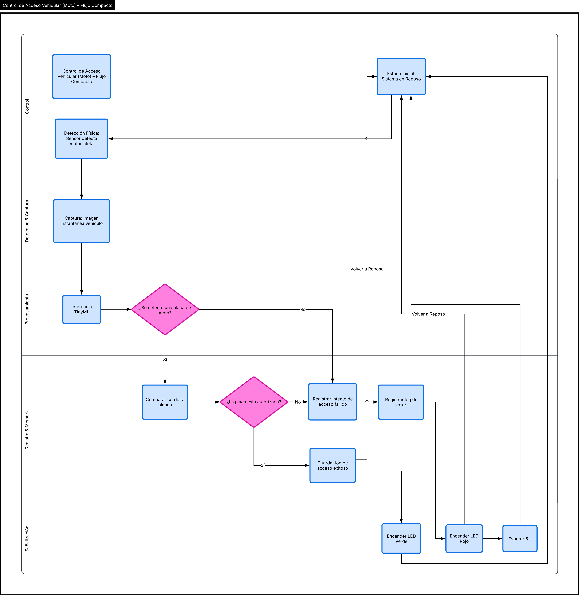

::: titlepage
**Sistema Automatizado de Control Vehicular Basado en TinyML y Edge
Computing para la Sede Tintal de la ETITC**

**Ing. Laura Juliana Huertas Huertas**\
**Ing. Hernán Camilo Guerrero Forero**

Asesor:\
**Ing.**

Escuela Tecnológica Instituto Técnico Central\
Especialización en Instrumentación Industrial\
Proyecto Integrador II\
Bogotá D.C.\
2026
:::

# Resumen {#resumen .unnumbered}

El presente proyecto propone el diseño e implementación de un sistema
automatizado de ingreso y salida vehicular en la sede Tintal de la
ETITC, basado en el uso de redes neuronales ligeras ejecutadas en el
borde (Edge Computing / TinyML). Actualmente, el proceso de control se
realiza de forma manual, generando demoras y limitada trazabilidad. La
propuesta busca desarrollar un prototipo funcional sobre un sistema
embebido, capaz de reconocer placas vehiculares mediante una red
neuronal ligera optimizada para microcontrolador. Esto reducirá los
tiempos de ingreso y fortalecerá la confiabilidad del sistema sin
recurrir a infraestructura costosa.

**Palabras clave:** TinyML, Edge Computing, control vehicular,
microcontroladores, automatización.

# Introducción

El aumento constante del parque automotor a nivel global ha generado
nuevos desafíos en la gestión de accesos y estacionamientos
institucionales. La carencia de sistemas eficientes de control provoca
congestión, tiempos de espera prolongados y dificultades logísticas,
problemáticas que suelen enfrentarse mediante infraestructura
automatizada de alto costo o personal operativo permanente, limitando su
viabilidad en entornos con restricciones presupuestales
[@alam2023survey]. A este escenario se suma la inminente transición
hacia la movilidad eléctrica, la cual exige que las infraestructuras
universitarias modernicen sus accesos como paso habilitador hacia la
consolidación de campus inteligentes
[@leurent2011mobility; @efthymiou2017ev; @subash2025ev].

En el ámbito educativo, los sistemas tradicionales ---basados en
verificación manual o mecanismos electromecánicos convencionales---
generan cuellos de botella críticos. De acuerdo con la literatura sobre
flujos de tránsito, la validación manual introduce una alta variabilidad
en el tiempo de servicio, produciendo filas que pueden oscilar entre uno
y cinco minutos por vehículo en horas pico, afectando directamente la
puntualidad académica y la eficiencia del recinto [@fhwa_traffic_2017].

Para mitigar estas deficiencias, diversas investigaciones han explorado
tecnologías emergentes. @celaya2020fog propusieron un sistema
descentralizado basado en *fog computing* para procesar datos cerca de
la fuente, reduciendo la latencia; mientras que
@marshoodulla2024sdiotpark desarrollaron un marco de análisis mediante
IoT para la gestión dinámica del flujo. No obstante, como señalan
@alam2023survey, estas soluciones presentan serias limitaciones de
escalabilidad económica al depender de servidores dedicados y
conectividad constante.

A nivel regional, implementaciones como el sistema RFID de
@olivares2011rfid o el reconocimiento de placas propuesto por
@valeo2020patentes en Argentina demostraron la efectividad de la
automatización, pero ratificaron que la dependencia de cámaras
industriales o infraestructura física robusta sigue siendo una barrera
de adopción para instituciones públicas.

En contraste, investigaciones recientes como la de @zheng2025iot
evidencian que las arquitecturas de redes neuronales ligeras pueden
ejecutarse eficientemente en dispositivos de recursos restringidos,
reduciendo drásticamente el consumo energético y la inversión requerida.

A partir de esta revisión, se identifica una brecha tecnológica: la
ausencia de propuestas orientadas a entornos educativos que integren
reconocimiento automático de placas mediante modelos de aprendizaje
automático ligero ejecutados directamente en microcontroladores (*Edge
Computing*), eliminando la dependencia de servidores externos.

En respuesta a esta necesidad, el presente proyecto desarrolla un
sistema automatizado de control vehicular basado en *TinyML* para la
sede Tintal de la ETITC. El sistema ejecuta la inferencia directamente
en un dispositivo embebido con cámara integrada, gestionando una lista
de autorización local para generar una señal de acceso inmediata. Con
esta implementación, se busca demostrar la viabilidad técnica de la
inteligencia artificial en el borde para optimizar los tiempos de
ingreso y la trazabilidad, ofreciendo una solución escalable y
económicamente sostenible.

# Justificación

El proceso actual de control vehicular en la sede Tintal de la ETITC
opera mediante verificación manual de documentos, lo que genera
congestión en horas pico y una total ausencia de registros históricos.
La literatura advierte que la dependencia exclusiva de la intervención
humana en procesos administrativos incrementa la probabilidad de error y
anula la trazabilidad institucional. Al respecto, @macias1996acceso
documenta que la digitalización es el único mecanismo efectivo para
mitigar fallas operativas y garantizar un flujo de información
constante. En el contexto educativo, @oloriz2022certificacion
demostraron que la automatización de procesos universitarios democratiza
la disponibilidad de la información, permitiendo auditorías y decisiones
estratégicas basadas en datos reales y no en suposiciones.

Si bien existen múltiples investigaciones que proponen optimizar el
control vehicular mediante IoT y *fog computing* ---como el sistema de
parqueo inteligente implementado por @celaya2020fog, el cual reduce la
latencia procesando los datos cerca de la fuente---, estas arquitecturas
presentan una barrera crítica para su adopción en instituciones de
educación pública: el costo de implementación y mantenimiento.

En su revisión exhaustiva sobre sistemas inteligentes de parqueo,
@alam2023survey concluyen que el principal obstáculo para la
masificación tecnológica es el alto costo de infraestructura. Un sistema
comercial estándar de reconocimiento de placas (LPR) requiere cámaras
industriales y servidores dedicados, lo que implica una inversión
inicial que oscila entre los \$2,000 y \$4,000 USD por punto de acceso,
sumado a los gastos recurrentes de licenciamiento de software y
mantenimiento especializado. Para una institución con recursos
limitados, esta carga financiera resulta insostenible.

Por otro lado, las soluciones basadas en identificación por
radiofrecuencia (RFID), analizadas por @olivares2011rfid, presentan un
desafío logístico y económico diferente centrado en el usuario. Aunque
la inversión en lectoras es alta, el verdadero problema radica en los
*tags* o tarjetas de acceso, cuyo costo oscila entre \$2 y \$5 USD por
unidad. En un entorno universitario caracterizado por una población
estudiantil rotativa, la gestión, reposición por pérdida y entrega
continua de miles de tarjetas genera un gasto operativo (OPEX)
recurrente que desborda los presupuestos de bienestar universitario.

Frente a este escenario de costos prohibitivos, tecnologías emergentes
como *TinyML* permiten ejecutar modelos de inteligencia artificial
directamente en microcontroladores de bajo costo (inferiores a \$50
USD). @warden2020tinyml demuestran que es posible realizar inferencias
de modelos complejos en estos dispositivos sin necesidad de conexión a
servidores externos. Esto valida los hallazgos de @zheng2025iot, quienes
lograron un reconocimiento vehicular eficiente eliminando la dependencia
de la nube. Al procesar las imágenes localmente mediante *Edge
Computing*, se suprimen los costos asociados a servidores, se minimiza
el consumo de ancho de banda y se evita la adquisición de hardware
industrial [@satyanarayanan2017edge].

Por consiguiente, implementar un sistema de control vehicular mediante
*TinyML* y *Edge Computing* representa una alternativa técnicamente
robusta y económicamente sostenible para la ETITC. Esta solución
proyecta reducir la inversión inicial en más de un 90% respecto a las
alternativas comerciales, automatiza el proceso sin generar costos
recurrentes por usuario y garantiza una trazabilidad total del acceso
vehicular.

# Planteamiento del Problema

En la sede Tintal de la Escuela Tecnológica Instituto Técnico Central
(ETITC), el control de ingreso y salida vehicular se realiza mediante
verificación manual de documentos por parte del personal de seguridad.
Este procedimiento exige que cada vehículo se detenga por completo
mientras se valida la identidad del conductor y su respectiva
autorización. Dicha dinámica incrementa exponencialmente los tiempos de
espera y genera congestión en los accesos durante las franjas horarias
de mayor afluencia, ocasionando filas que impactan el inicio de las
actividades académicas.

A falta de instrumentación previa en el sitio, se ha realizado una
modelización teórica del sistema manual fundamentada en los estándares
de la *Federal Highway Administration* (FHWA) y en estudios de flujo
vehicular universitario [@fhwa_traffic_2017; @aljaleel2022traffic].
Según estos referentes, el ciclo de validación manual (que incluye la
detención, interacción con el guarda, búsqueda del documento y registro)
consume un tiempo de servicio promedio ($\mu$) de entre 21 y 45 segundos
por vehículo.

Bajo un modelo de teoría de colas M/M/1, esto implica que el sistema
manual posee una capacidad máxima teórica de apenas 2 vehículos por
minuto. En horas pico, donde la tasa de llegada ($\lambda$) supera esta
capacidad (e.g., $\lambda > 2.5$ vehículos/minuto), el factor de
utilización del sistema ($\rho$) excede el 100%. Este desbordamiento
explica matemáticamente la formación de colas infinitas y la
inestabilidad operativa observada en la sede Tintal. A esto se suma que
la fatiga operativa del personal, derivada de la verificación visual
continua, incrementa la probabilidad de error y vulnera la seguridad del
recinto [@aamva_alpr_2021].

Experiencias documentadas evidencian que los procesos de validación
estrictamente manuales en accesos institucionales generan ineficiencias
operativas crónicas, carecen de trazabilidad y dependen de forma
absoluta de la intervención humana
[@macias1996acceso; @oloriz2022certificacion]. Al carecer de registros
históricos digitalizados, la institución pierde la capacidad de realizar
análisis de gestión o auditorías de seguridad.

En años recientes, múltiples investigaciones han demostrado que la
automatización de estacionamientos mediante el Internet de las Cosas
(IoT), *fog computing* o sistemas RFID mejora sustancialmente la gestión
de los accesos
[@celaya2020fog; @marshoodulla2024sdiotpark; @olivares2011rfid]. Sin
embargo, estas soluciones presentan barreras de adopción críticas para
las instituciones educativas públicas, tales como altas inversiones en
infraestructura física, dependencia de servidores externos y necesidad
de adecuaciones civiles o cableado especializado
[@alam2023survey; @valeo2020patentes].

En contraste, tecnologías emergentes como las *redes neuronales ligeras*
habilitan la ejecución de modelos de inteligencia artificial
directamente en microcontroladores de bajo costo, eliminando la
necesidad de procesamiento centralizado [@zheng2025iot]. Esta capacidad
contrasta fuertemente con los sistemas LPR existentes que exigen
servidores dedicados o cámaras industriales, los cuales inflan los
costos y bloquean su implementación en contextos académicos con
restricciones presupuestales [@alam2023survey].

A partir de este diagnóstico técnico y matemático, se identifican las
siguientes limitaciones críticas en el proceso actual de la sede Tintal:

- **Ineficiencia operativa:** El tiempo de servicio manual ($\mu$)
  provoca una saturación del sistema ($\rho > 100\%$) y congestión en
  los accesos.

- **Ausencia de trazabilidad:** La inexistencia de un registro digital
  impide el análisis estadístico y la toma de decisiones basada en
  datos.

- **Vulnerabilidad humana:** El proceso está sujeto a tiempos de
  validación altamente variables y a errores por fatiga visual del
  operador.

Lo anterior evidencia la necesidad imperativa de un sistema automatizado
de validación vehicular que reduzca los tiempos de ingreso, minimice la
intervención humana y garantice la trazabilidad de los accesos, todo
ello estructurado sobre una arquitectura tecnológicamente viable y
económicamente sostenible para la ETITC.

# Objetivos y Pregunta de Investigación

## Objetivo General

Desarrollar un sistema automatizado de ingreso y salida de vehículos
automotores en el parqueadero universitario de la sede Tintal de la
ETITC, basado en reconocimiento de placas mediante modelos de *redes
neuronales ligeras* desplegados sobre *Sistemas Embebidos*, mediante
redes de sensores y sistemas electrónicos de potencia, con el propósito
de optimizar el control de ingreso y salida vehicular, mejorar la
trazabilidad de los registros y reducir la dependencia de procedimientos
manuales.

## Objetivos Específicos

- Implementar un sistema de validación de credenciales vehiculares y
  estudiantiles mediante redes de sensores y modelos de *redes
  neuronales ligeras* ejecutados en dispositivos embebidos.

- Desplegar un modelo de reconocimiento de placas vehiculares capaz de
  operar con baja latencia, mediante procesamiento local en el
  dispositivo y capaz de activar un actuador mediante sistemas
  electrónicos de potencia.

- Diseñar un módulo de gestión de trazabilidad que permita almacenar,
  consultar y analizar los registros de ingreso y salida de vehículos de
  forma segura y confiable.

## Pregunta de Investigación

¿De qué manera un sistema embebido basado en redes neuronales ligeras y
Edge Computing puede mejorar la eficiencia y trazabilidad del control
vehicular en la sede Tintal de la ETITC, reduciendo los costos de
infraestructura respecto a los métodos tradicionales?

# Alcance y Delimitaciones

Para garantizar la viabilidad técnica del desarrollo y la correcta
evaluación del prototipo funcional (Producto Mínimo Viable - MVP) dentro
de las restricciones de memoria de la plataforma embebida, el alcance
inicial del proyecto se delimita de la siguiente manera:

- **Focalización vehicular:** El sistema de visión artificial y la red
  neuronal se entrenarán de manera exclusiva para la detección y
  reconocimiento de **placas de motocicletas**. Esta delimitación
  responde a las diferencias morfológicas y geométricas que presentan
  estas placas frente a las de automóviles convencionales, lo que
  requiere un enfoque especializado en el *dataset* para asegurar una
  alta tasa de aciertos en la inferencia local.

- **Entorno de validación:** Aunque el diseño se proyecta para la Sede
  Tintal, las pruebas de validación del prototipo se ejecutarán en la
  Sede Centro de la ETITC, simulando las condiciones de iluminación y
  distancia requeridas.

- **Actuación física:** La validación de acceso exitoso se representará
  mediante una etapa de señalización lumínica (LED de estado), omitiendo
  la instalación de barreras mecánicas o talanqueras reales durante esta
  fase de demostración tecnológica.

# Marco Teórico

## Sistemas de Parqueo Inteligente (Smart Parking)

Los sistemas de parqueo inteligente son soluciones tecnológicas
orientadas a optimizar el uso de espacios de estacionamiento mediante la
automatización del proceso de monitoreo, detección y gestión de
disponibilidad. Su objetivo es reducir la búsqueda de espacios,
descongestionar zonas urbanas y disminuir el consumo de combustible
asociado a la circulación sin destino [@alam2023survey]. Según
@alam2023survey, los sistemas de parqueo inteligente combinan sensores,
conectividad IoT y analítica de datos para gestionar el flujo vehicular
en tiempo real.

@celaya2020fog proponen un sistema de parqueo inteligente basado en *fog
computing*, demostrando que el procesamiento cercano al usuario reduce
el tiempo de respuesta frente a soluciones dependientes exclusivamente
de servidores en la nube. @marshoodulla2024sdiotpark complementan esta
visión con un enfoque SDN-IoT, donde el flujo de datos se controla
dinámicamente, mejorando la eficiencia del sistema.

## Fog Computing y Edge Computing

El *fog computing* es una arquitectura distribuida que permite procesar
datos cerca de su origen, en lugar de enviarlos a servidores remotos.
@celaya2020fog demuestran que esta arquitectura reduce la latencia,
minimiza la congestión en la red y mejora el rendimiento de aplicaciones
IoT en tiempo real. Mientras que la nube requiere enviar información a
un servidor central, el *fog computing* utiliza nodos intermedios que
permiten decisiones más rápidas y eficientes.

El *edge computing* comparte el principio de procesamiento local, pero
lo enfoca directamente en el dispositivo final (sensores, cámaras o
microcontroladores). Según @zheng2025iot, la ejecución de modelos de
visión artificial directamente en el borde reduce el flujo de datos
transmitidos y disminuye los costos operativos al eliminar
infraestructura de servidores centralizados.

## Visión por Computador

La visión por computador es una rama de la inteligencia artificial cuyo
propósito es permitir que una máquina interprete información visual del
entorno ---imágenes o video--- y tome decisiones basadas en dicha
interpretación. Aplicada a sistemas de parqueo inteligente, permite
identificar objetos (vehículos), reconocer estados (espacio ocupado o
libre) y ejecutar acciones automatizadas en consecuencia.

@zheng2025iot implementaron redes neuronales ligeras para clasificación
de imágenes en sistemas de estacionamiento, demostrando que es posible
realizar procesamiento en tiempo real incluso en hardware embebido.

## TinyML y Redes Neuronales Ligeras

TinyML es una disciplina que permite ejecutar modelos de aprendizaje
automático en microcontroladores y dispositivos de bajo consumo
energético. De acuerdo con @tinyml2022EdgeImpulse, el uso de TinyML
reduce la necesidad de transmitir datos hacia la nube, disminuyendo
costos y aumentando la seguridad de los datos.

Edge Impulse provee herramientas para entrenar modelos y exportarlos
directamente a microcontroladores sin necesidad de infraestructura de
cómputo avanzada [@edgeimpulseDocs]. Esta capacidad permite desarrollar
prototipos funcionales en contextos académicos con recursos limitados.

## Microcontroladores en Automatización

Los microcontroladores son dispositivos electrónicos programables
diseñados para controlar sistemas embebidos. Su uso en automatización
educativa ha sido ampliamente estudiado. @candelas2015arduino muestran
que plataformas basadas en microcontroladores facilitan el aprendizaje
de robótica, control y electrónica en entornos formativos, permitiendo
la experimentación práctica a bajo costo. Su integración con sensores y
actuadores hace viable el desarrollo de sistemas automáticos que
reaccionen a condiciones detectadas mediante visión artificial.

## Impresión 3D en Prototipado Rápido

La fabricación aditiva en impresión 3D permite desarrollar prototipos
físicos de manera rápida y económica. Esta metodología reduce los
tiempos de iteración en diseño y evita los costos de manufactura
tradicional, lo que resulta ideal para proyectos de automatización que
requieren ajustes frecuentes en componentes mecánicos.

# Estado del Arte

El estado del arte reúne las soluciones y enfoques más relevantes en
automatización de accesos vehiculares, con especial atención en
arquitecturas de computación distribuida (cloud, fog, edge), sistemas
comerciales de parqueo y las últimas aportaciones en TinyML para
ejecución en dispositivos embebidos.

## Arquitecturas de Procesamiento: Cloud, Fog y Edge

Las arquitecturas basadas en la nube (cloud) concentran el procesamiento
en centros remotos, ofreciendo alta capacidad de cómputo y
almacenamiento, pero fomentando dependencia de conectividad, aumento de
latencia y mayor tráfico de red. Frente a esto, el *fog computing*
propone nodos intermedios que procesan datos cerca de la fuente y
reducen la latencia y el tráfico hacia la nube
[@bonomi2012fog; @celaya2020fog]. @celaya2020fog evidencian que el *fog
computing* es efectivo en aplicaciones de parqueo inteligente al mejorar
la capacidad de respuesta en escenarios con múltiples puntos de
adquisición.

Por su parte, el *edge computing* lleva el procesamiento aún más cerca
del extremo ---en el propio dispositivo o en su entorno inmediato---, lo
que permite inferencias en tiempo real y reduce la necesidad de ancho de
banda. @satyanarayanan2017edge y @zheng2025iot describen cómo la
ejecución de modelos en el borde disminuye costos operativos asociados
al envío continuo de datos a servidores centrales, y es adecuada para
aplicaciones de visión por computador con requisitos de baja latencia.

## Sistemas Comerciales y Propuestas Académicas de Parqueo Inteligente

La literatura documenta múltiples implementaciones que usan sensores,
RFID, cámaras y plataformas IoT para la gestión de parqueos.
@alam2023survey realizan una revisión amplia y concluyen que las
soluciones actuales combinan sensores de ocupación, análisis en la nube
y *dashboards* para administración, aunque resaltan como desafío
principal los costos de infraestructura y el mantenimiento a escala.
@olivares2011rfid muestra un despliegue basado en RFID que exige
lectoras y etiquetas por vehículo, lo cual incrementa el costo por
plaza. @valeo2020patentes describen sistemas de reconocimiento de
matrículas basados en cámaras industriales que, aunque efectivos en
precisión, presentan barreras de adopción por su costo y necesidad de
calibración y mantenimiento continuo.

En el ámbito académico, @celaya2020fog y @marshoodulla2024sdiotpark
proponen arquitecturas distribuidas (fog/SDN-IoT) para gestionar datos y
optimizar respuesta. Estas propuestas prueban mejoras en latencia y
control del flujo; sin embargo, siguen ancladas a infraestructuras que
requieren inversión elevada.

## TinyML, Edge Impulse y Avances en IA Embebida

La aparición de TinyML ha permitido ejecutar modelos de aprendizaje
automático en microcontroladores de bajo costo, habilitando aplicaciones
de visión y clasificación directamente en el dispositivo.
@warden2020tinyml presentan las bases de TinyML y muestran cómo modelos
cuantizados pueden correr en hardware con memoria y potencia limitadas.
Estudios recientes [@tinyml2022EdgeImpulse; @zheng2025iot] muestran
implementaciones de reconocimiento vehicular y clasificación utilizando
redes ligeras, validando su viabilidad en entornos embebidos.

Edge Impulse ofrece un flujo de trabajo práctico para TinyML:
adquisición de datos, entrenamiento automático y exportación a
microcontroladores, reduciendo el tiempo de desarrollo y la necesidad de
conocimientos expertos en optimización de modelos [@edgeimpulseDocs].
Investigaciones aplicadas respaldan su eficacia en escenarios reales y
educativos, facilitando la transición desde prototipo a despliegue
embebido [@tinyml2022EdgeImpulse].

Complementando lo anterior, @hossain2020embeddedml destaca que la
integración de *Embedded Machine Learning* es el futuro de las
aplicaciones IoT sostenibles. Estudios de @nguyen2023edge validan
específicamente esta arquitectura para el reconocimiento de placas,
reportando tasas de precisión superiores al 90% y latencias inferiores a
200 ms ejecutando modelos ligeros en dispositivos de borde.

## Limitaciones Identificadas en el Estado del Arte

A partir de la revisión, se identifican limitaciones repetidas en la
literatura:

- **Costos de infraestructura:** Soluciones basadas en cámaras
  industriales, servidores y sistemas RFID aumentan el costo por plaza y
  complican la escalabilidad
  [@alam2023survey; @olivares2011rfid; @valeo2020patentes].

- **Dependencia de conectividad:** Arquitecturas cloud pierden eficacia
  en escenarios con conectividad limitada o con alto volumen de eventos
  en tiempo real [@bonomi2012fog].

- **Mantenimiento y calibración:** Equipos de visión especializados
  requieren calibración y mantenimiento regular, elevando costos
  operativos [@valeo2020patentes].

- **Brecha en entornos educativos:** Pocas propuestas están diseñadas
  para instituciones con recursos limitados; muchas se centran en
  entornos de alto presupuesto [@alam2023survey].

## Cómo se Posiciona el Presente Proyecto

El proyecto propuesto se posiciona en la intersección de *Edge
Computing* y *TinyML* con un enfoque en replicabilidad y bajo costo para
entornos educativos. La propuesta busca:

- Ejecutar inferencia de reconocimiento de placas directamente en
  microcontroladores, reduciendo la necesidad de servidores o cámaras
  industriales [@warden2020tinyml; @zheng2025iot].

- Emplear plataformas accesibles (Edge Impulse) durante la fase inicial
  para acelerar el entrenamiento y validación sin incurrir en costos de
  licenciamiento [@edgeimpulseDocs; @tinyml2022EdgeImpulse].

- Diseñar una arquitectura modular y escalable que permita integrar
  distintos sensores y actuadores sin casarse con un proveedor
  específico.

::: {#tab:comparativa}
  **Enfoque**       Ventajas                                                                                                                                                  Limitaciones
  ----------------- --------------------------------------------------------------------------------------------------------------------------------------------------------- ----------------------------------------------------------------------------------------------------------------------------
  **Cloud**         Gran capacidad de cómputo y almacenamiento; permite modelos complejos y análisis intensivo de datos.                                                      Latencia alta, dependencia de la conectividad y costos operativos asociados a infraestructura en la nube [@bonomi2012fog].
  **Fog**           Procesamiento distribuido y reducción de latencia al ubicar nodos intermedios cerca del usuario [@celaya2020fog].                                         Requiere infraestructura adicional (nodos fog), lo que incrementa la inversión inicial [@celaya2020fog].
  **Edge/TinyML**   Inferencia en tiempo real en el dispositivo; bajo costo de infraestructura; mejora la privacidad al no enviar datos [@zheng2025iot; @warden2020tinyml].   Limitaciones de memoria y capacidad de cómputo para modelos complejos; requiere optimización [@zheng2025iot].

  : Comparativa de enfoques de procesamiento en sistemas inteligentes de
  parqueo
:::

En síntesis, el estado del arte presenta soluciones robustas para
diversas escalas, pero ninguna atiende de forma consolidada las
restricciones económicas y de mantenimiento propias de muchas
instituciones educativas. El presente proyecto busca cerrar esta brecha
mediante la aplicación de TinyML y Edge Computing en una arquitectura
modular.

# Diseño Metodológico

## Enfoque Metodológico

La presente investigación se enmarca en un enfoque **cuantitativo de
tipo aplicado**, con un diseño **cuasi-experimental** y alcance
explicativo. El estudio consiste en el diseño, implementación y
validación experimental de un prototipo funcional de control vehicular
basado en redes neuronales ligeras desplegadas sobre un sistema
embebido.

El propósito metodológico es evaluar la viabilidad técnica de integrar
modelos de *TinyML* en un entorno real de operación, midiendo su impacto
en términos de latencia, precisión y eficiencia operativa frente al
procedimiento manual actualmente utilizado en la sede Tintal de la
ETITC.

## Variables del Estudio

**Variable Independiente:** Implementación de un sistema embebido basado
en redes neuronales ligeras para reconocimiento automático de placas
vehiculares.

**Variables Dependientes:**

- Tiempo promedio de validación vehicular (latencia del sistema).

- Precisión del reconocimiento (porcentaje de aciertos en inferencia).

- Generación correcta de señal digital de autorización hacia la etapa de
  potencia.

- Reducción porcentual del tiempo de acceso respecto al método manual.

## Correspondencia entre Objetivos, Fases y Actividades

Para garantizar la trazabilidad del proyecto, el diseño metodológico se
estructura en cuatro fases operativas. Cada fase agrupa una serie de
actividades secuenciales diseñadas para dar cumplimiento estricto a los
objetivos específicos planteados. La Tabla
[2](#tab:metodologia){reference-type="ref" reference="tab:metodologia"}
detalla esta alineación.

::: {#tab:metodologia}
  -------------------------------------------------------------------------------------------------------------------------------------------------------------------------------------------
  **Objetivo Específico**                                                       **Fase Metodológica**                       **Actividades Principales**
  ----------------------------------------------------------------------------- ------------------------------------------- -----------------------------------------------------------------
  . Implementar validación mediante sensores y redes neuronales embebidas.      Fase 1: Diseño de Arquitectura y Hardware   A1.1 Selección de la plataforma embebida.\
                                                                                                                            A1.2 Selección de la red de sensores.\
                                                                                                                            A1.3 Diseño mecánico y ensamblaje profesional (3D/PCB).\
                                                                                                                            A1.4 Propuesta de escalabilidad fotovoltaica.

  . Desplegar modelo de reconocimiento capaz de activar actuador de potencia.   Fase 2: Modelado TinyML y Señalización      A2.1 Estrategia de curaduría y minería de datos masivos.\
                                                                                                                            A2.2 Entrenamiento y optimización en Edge Impulse.\
                                                                                                                            A2.3 Diseño de la etapa de señalización visual (LED).

  . Diseñar módulo de gestión de trazabilidad segura y confiable.               Fase 3: Implementación de Trazabilidad      A3.1 Configuración de lista blanca en memoria local.\
                                                                                                                            A3.2 Registro de eventos y almacenamiento de logs en SD.

  Validación general del sistema frente a variables dependientes.               Fase 4: Pruebas, Validación y Evaluación    A4.1 Ejecución de pruebas en entorno controlado (Sede Centro).\
                                                                                                                            A4.2 Análisis estadístico comparativo vs. sistema manual.
  -------------------------------------------------------------------------------------------------------------------------------------------------------------------------------------------

  : Matriz de alineación metodológica: Objetivos, Fases y Actividades
  (Actualizada)
:::

## Fase 1: Diseño de Arquitectura y Hardware

Esta fase abarca la estructuración física del prototipo, priorizando
dispositivos que cumplan con las restricciones de procesamiento en el
borde (*Edge Computing*) y garantizando un acabado industrial.

### Actividad 1.1: Selección de la plataforma embebida

Para garantizar la viabilidad del procesamiento de imágenes en el borde,
se definieron criterios de evaluación específicos para visión artificial
y redes neuronales, descartando parámetros de instrumentación
convencional que no son críticos para este prototipo.

Se evaluaron tres alternativas tecnológicas utilizando una escala
cuantitativa de 1 (desempeño bajo) a 5 (desempeño alto), como se detalla
en la Tabla [3](#tab:matriz_decision){reference-type="ref"
reference="tab:matriz_decision"}. Los criterios evaluados fueron:

- **Costo de implementación:** Accesibilidad económica para garantizar
  escalabilidad.

- **Memoria RAM/PSRAM:** Capacidad para almacenar el *framebuffer* y los
  tensores del modelo.

- **Hardware de Visión:** Disponibilidad de cámara integrada para evitar
  latencia de transmisión.

- **Soporte TinyML:** Compatibilidad oficial con plataformas como *Edge
  Impulse*.

- **Eficiencia Energética:** Consumo de potencia para operar de forma
  autónoma.

::: {#tab:matriz_decision}
  **Plataforma**            Costo   Memoria (RAM)   Hardware de Visión   Soporte TinyML   Eficiencia Energética   **Puntaje Total**
  ------------------------- ------- --------------- -------------------- ---------------- ----------------------- -------------------
  **Raspberry Pi 4**                                                                                              **15**
  **Arduino Nano 33 BLE**                                                                                         **17**
  **ESP32-CAM**                                                                                                   **23**

  : Matriz de decisión para la selección de la plataforma embebida
:::

El análisis cuantitativo evidencia que el **ESP32-CAM** obtiene el mayor
puntaje (23 puntos). Su integración nativa del sensor OV2640, su memoria
PSRAM externa y su compatibilidad total para exportar librerías desde
*Edge Impulse* lo consolidan como la plataforma idónea, superando el
alto consumo de la Raspberry Pi y las limitaciones visuales del Arduino
Nano.

### Actividad 1.2: Selección de la red de sensores de activación

Para evitar que el modelo de *TinyML* procese imágenes continuamente y
sature el microcontrolador, se requiere un sensor de proximidad que
active la cámara únicamente cuando un vehículo esté en posición. Se
seleccionó el **sensor infrarrojo fotoeléctrico E18-D80NK**, el cual
ofrece un rango de detección ajustable, inmunidad a la luz solar
moderada y entrega una señal digital limpia directamente a los pines del
microcontrolador.

### Actividad 1.3: Diseño mecánico y ensamblaje profesional

Para garantizar una presentación técnica de alto nivel que prescinda por
completo de obras civiles e instalaciones invasivas, el hardware no se
presentará en placas de pruebas (protoboard). Todos los componentes se
soldarán sobre una placa fenólica (baquelita perforada) o circuito
impreso (PCB). Adicionalmente, se realizará el modelado CAD 3D de una
carcasa y base estructural tipo tótem, la cual será fabricada mediante
impresión 3D para alojar y proteger el microcontrolador, la cámara y la
fuente de alimentación, logrando un aspecto profesional e industrial.

### Actividad 1.4: Propuesta de escalabilidad energética (Sistema Fotovoltaico)

Como parte de la proyección de escalabilidad y autonomía del prototipo,
se contempla la futura integración de un sistema de alimentación
fotovoltaica. Aunque en la fase de Producto Mínimo Viable (MVP) el
sistema operará con una fuente de alimentación de corriente continua
estándar (5V/2A) debido a restricciones de tiempo y presupuesto, el
diseño mecánico y estructural dejará la provisión física para un panel
solar.

Este enfoque de nodo autónomo (*Off-Grid*) elimina la necesidad de
realizar acometidas eléctricas y obras civiles en los puntos de acceso
remotos de la universidad. Para el diseño en software CAD, se dimensionó
un panel monocristalino de 20W
($450 \text{ mm} \times 350 \text{ mm} \times 25 \text{ mm}$). Este
panel alimentaría un controlador de carga PWM acoplado a una batería de
respaldo (por ejemplo, ácido-plomo de 12V 7Ah), garantizando la
operación continua del microcontrolador y el sensor durante las horas
nocturnas o de baja radiación.

Para reducir el voltaje de los 12V de la batería a los 5V requeridos por
el ESP32-CAM, el circuito integrará un módulo reductor (Step-Down)
LM2596. A continuación, en la Tabla
[4](#tab:cotizacion_solar){reference-type="ref"
reference="tab:cotizacion_solar"}, se presenta una proyección de costos
estimada para esta mejora futura:

::: {#tab:cotizacion_solar}
  Componente                              Cantidad         Valor Unitario (COP)   **Valor Total (COP)**
  --------------------------------------- ---------------- ---------------------- -----------------------
  Panel Solar Monocristalino (20W, 12V)                    \$ 85,000              **\$ 85,000**
  Controlador de Carga Solar (PWM 10A)                     \$ 35,000              **\$ 35,000**
  Batería Seca Recargable (12V, 7Ah)                       \$ 65,000              **\$ 65,000**
  Módulo Reductor Step-Down LM2596                         \$ 8,000               **\$ 8,000**
  Estructura de fijación y cableado                        \$ 25,000              **\$ 25,000**
                                          **\$ 218,000**                          

  : Proyección de costos para escalabilidad con sistema fotovoltaico
  autónomo
:::

## Fase 2: Modelado TinyML y Etapa de Señalización

En esta etapa se desarrolla el núcleo inteligente del sistema, el
entrenamiento de la red neuronal y su capacidad de accionar el entorno
físico tras una lectura exitosa.

### Actividad 2.1: Estrategia de curaduría y minería de datos masivos

Para alcanzar la meta de **2000 imágenes focalizadas**, se implementará
una estrategia de curaduría de datos multivariante. Según la
investigación documental realizada, se priorizará la extracción de
información de repositorios especializados como Zenodo [@zenodo2026] y
Kaggle, así como el uso de técnicas de *Web Scraping* en bases de datos
de tránsito regionales [@alam2023survey].

Un componente innovador de esta fase será la inclusión de **Datos
Sintéticos**. Se utilizarán generadores de placas basados en algoritmos
de aprendizaje profundo, como los modelos de difusión y generadores
sintéticos disponibles en plataformas de desarrollo colaborativo
[@githubAdil2026], para crear variaciones tipográficas y geométricas que
emulen con precisión el estándar de las motocicletas en Colombia. Este
enfoque de "Aumento de Datos\" (*Data Augmentation*) es fundamental para
robustecer la red neuronal ante condiciones de baja visibilidad,
oclusiones parciales y diversos ángulos de inclinación, garantizando una
precisión superior al 90% en la inferencia final ejecutada en el borde.

### Actividad 2.2: Entrenamiento y optimización en Edge Impulse

Se empleará la plataforma *Edge Impulse* para etiquetar las imágenes y
entrenar la red neuronal ligera. En esta actividad se aplicarán técnicas
de cuantización (reduciendo los tensores de 32-bit flotante a 8-bit
entero) para minimizar la huella de memoria (RAM y Flash) del modelo,
garantizando que pueda ser exportado como una librería de C++ y
ejecutado fluidamente en los limitados recursos del ESP32-CAM.

### Actividad 2.3: Diseño de la etapa electrónica y señalización visual

Una vez el modelo genera una inferencia positiva (placa reconocida y
validada), el microcontrolador debe interactuar con el mundo físico.
Esta actividad consiste en el diseño de un circuito de acople que
integre un indicador lumínico (LED de alta luminosidad). Este diodo
actuará como semáforo y prueba física de validación, encendiéndose para
simular la señal de paso o apertura de talanquera, lo que permitirá
demostrar la funcionalidad total del sistema ante los evaluadores sin
requerir actuadores mecánicos a gran escala.

## Fase 3: Implementación del Módulo de Trazabilidad

Para dar respuesta a la necesidad de auditoría institucional sin
depender de infraestructuras en la nube, se diseña un sistema de
registro local.

### Actividad 3.1: Configuración de lista blanca

Se programará una estructura de datos en la memoria local del
dispositivo que contenga las credenciales (placas) autorizadas,
garantizando que la validación ocurra en milisegundos sin latencia de
red.

### Actividad 3.2: Registro de eventos (Logs)

Se implementará una rutina que, tras cada evento de lectura, guarde un
registro con el resultado de la inferencia, la placa detectada y la
estampa de tiempo, almacenándolo en una memoria SD vinculada al sistema
embebido.

## Fase 4: Pruebas, Validación y Evaluación

La fase final consolida los resultados experimentales para responder a
la pregunta de investigación.

### Actividad 4.1: Pruebas en entorno controlado

Se realizarán iteraciones de validación (mínimo 30 pruebas sistemáticas)
utilizando vehículos autorizados y no autorizados. Se documentarán
variables como el nivel de confianza arrojado por el modelo, los falsos
positivos/negativos y el tiempo de ejecución de la inferencia
directamente en el puerto serial del microcontrolador.

### Actividad 4.2: Evaluación comparativa de eficiencia

Se calculará la estadística descriptiva de los tiempos de respuesta del
prototipo automatizado. Estos datos se contrastarán matemáticamente
contra los 21 a 45 segundos promedio que toma actualmente el
procedimiento manual, permitiendo cuantificar la mejora porcentual en la
eficiencia operativa del ingreso vehicular a la institución.

<figure id="fig:diagrama_flujo" data-latex-placement="H">

<em>Nota.</em> Elaboración propia (2026), en Lucidchart.

<figcaption>Algoritmo lógico de reconocimiento y control de
acceso.</figcaption>
</figure>

# Presupuesto del Prototipo

Para la ejecución del Producto Mínimo Viable (MVP), se ha diseñado un
presupuesto optimizado que refleja la viabilidad económica del proyecto.
A diferencia de los sistemas comerciales, este prototipo utiliza
componentes de bajo costo y alta eficiencia. En la Tabla
[5](#tab:presupuesto_mvp){reference-type="ref"
reference="tab:presupuesto_mvp"} se detallan los costos de los insumos
principales:

::: {#tab:presupuesto_mvp}
  Componente                                Cantidad         Valor Unitario   **Valor Total**
  ----------------------------------------- ---------------- ---------------- -----------------
  Microcontrolador ESP32-CAM (con cámara)                    \$ 60,000        **\$ 60,000**
  Sensor Infrarrojo E18-D80NK                                \$ 22,000        **\$ 22,000**
  Módulo Relé de 1 canal (5V)                                \$ 8,500         **\$ 8,500**
  Placa Fenólica y conectores                                \$ 15,000        **\$ 15,000**
  Insumos Impresión 3D (Filamento PLA)                       \$ 20,000        **\$ 20,000**
  Fuente de poder 5V/2A                                      \$ 18,000        **\$ 18,000**
                                            **\$ 143,500**                    

  : Presupuesto estimado para el prototipo funcional (MVP)
:::

# Cronograma de Actividades

El desarrollo del proyecto se proyecta en un periodo de 8 semanas,
distribuidas para cubrir desde la adquisición de datos hasta la
validación final. La Tabla [6](#tab:cronograma){reference-type="ref"
reference="tab:cronograma"} muestra la distribución temporal de las
fases metodológicas:

::: {#tab:cronograma}
  **Actividad / Semana**                   **1**   **2**   **3**   **4**   **5**   **6**   **7**   **8**
  --------------------------------------- ------- ------- ------- ------- ------- ------- ------- -------
  A1. Diseño de Hardware y 3D                X       X                                            
  A2. Recolección de imágenes (2000)                 X       X       X                            
  A3. Entrenamiento en Edge Impulse                                  X       X                    
  A4. Programación y Trazabilidad local                                      X       X            
  A5. Ensamblaje en PCB y Carcasa                                                    X       X    
  A6. Pruebas y Evaluación final                                                             X       X

  : Cronograma de ejecución del proyecto (Semanas)
:::
